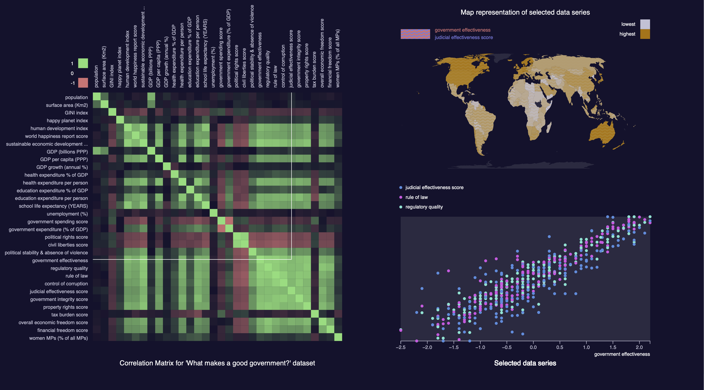

# Data Visualisation - Final project 2022

Visualisation of the World Data Visualization Prize dataset on “What Makes A “Good” Government?”. The dataset can be found at https://informationisbeautiful.net/2018/announcing-the-world-data-visualization-prize-a-40k-dataviz-challenge/

Tech stack: Javascript, HTML, CSS and D3.

Example View:

To run, enter the following command from this folder:

`python3 -m http.server`

Then go to `http://localhost:8000/` to view.
